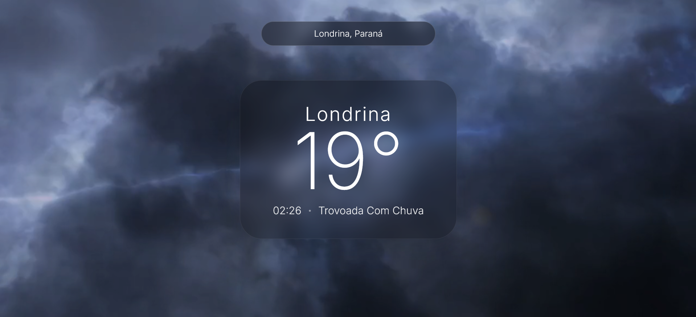
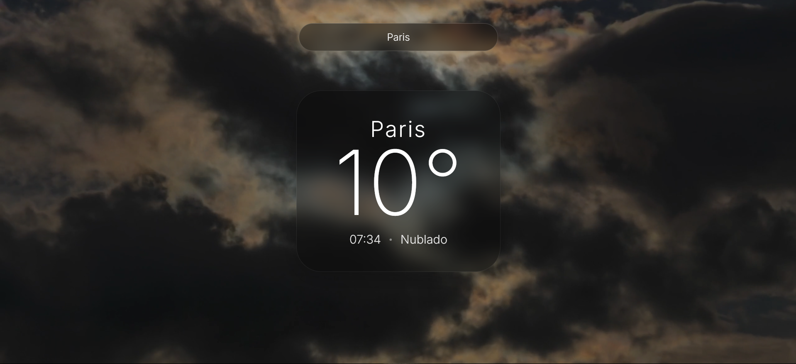

# Go Outside - Weather Application

  
  

 

  
  
  

## Link do Projeto
Acesse a aplicação em execução: [https://publiodavi.github.io/project-go-outside/](https://publiodavi.github.io/project-go-outside/)

## Sobre o Projeto
O Go Outside é uma aplicação meteorológica desenvolvida com foco em fidelidade visual, experiência do usuário (UX) e consumo avançado de APIs assíncronas. O projeto foi estruturado para resolver desafios técnicos de desenvolvimento front-end, como otimização de requisições, tratamento de fusos horários dinâmicos e manipulação de estado, consolidando conhecimentos práticos voltados para o curso de Análise e Desenvolvimento de Sistemas da FATEC.

## Principais Funcionalidades
- **Mídia Dinâmica por Clima:** Algoritmo que mapeia as 15 condições climáticas oficiais da API (Current Weather) e renderiza um vídeo de fundo correspondente à atmosfera da região pesquisada, incluindo variações de dia, noite e fenômenos de baixa visibilidade.
- **Autocompletar com Debounce:** Integração com a Geocoding API para sugestão de cidades em tempo real. A implementação de debounce (500ms) retém a execução enquanto o usuário digita, minimizando chamadas desnecessárias e otimizando o consumo da API.
- **Cálculo de Fuso Horário Local:** Processamento dos dados de timestamp e offsets retornados pela API para exibir o horário exato da cidade destino, operando de forma independente do fuso horário configurado no dispositivo do usuário.
- **Interface Glassmorphism:** Estilização baseada em desfoque de fundo (backdrop-filter), tipografia minimalista e transições de montagem fluidas utilizando a biblioteca Framer Motion.

## Tecnologias Utilizadas
- **React.js + Vite:** Arquitetura base para componentização de alta performance.
- **Framer Motion:** Orquestração de animações e gerenciamento de transições de estado da interface.
- **OpenWeatherMap API:** Consumo das rotas de dados climáticos e geocodificação via Fetch API nativa.
- **CSS3:** Estilização modular e customizada, sem dependência de frameworks externos.

## Autor
Davi de Souza Públio